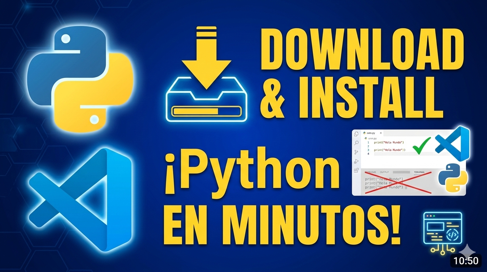

<div align="center">
    <kbd>
        <h1><b>CURSO DE PYTHON</b><br>INTRODUCCIÓN GENERAL</b></h1>
        
    </kbd>
    <br>
    <br>
    <h2><b>INSTALACION & CONFIGURACIÓN DE VS CODE</b></h2>
</div>

<br>

**Visual Studio Code (`VSCode`)** es uno de los editores de código más populares del momento. Es un editor ligero, con una extensa comunidad de desarrolladores.

Una de las ventajas de VSCode es que es compatible con una gran variedad de lenguajes. Entre los que, por supuesto, se incluye Python (de hecho, es uno de los mejores entornos que podemos usar para programar en Python).

Así que vamos a ver cómo instalar y, sobre todo, cómo configurar el VSCode para el desarrollo de Python

<br><br>

## **Instalación de Visual Studio Code**

<br><br>

Si aún no tienes `Visual Studio Code` instalado en tu sistema, sigue estos pasos para `descargar` e `instalar` el editor:

<br>

    PASO 1. ABRIMOS EL NAVEGADOR WEB Y DIRÍGETE AL SITIO WEB OFICIAL DE VISUAL STUDIO CODE.


<div align="center">

</div>

<br><br>

    PASO 2. HAZ CLIC EN EL BOTÓN DE DESCARGA PARA TU SISTEMA OPERATIVO (WINDOWS, MACOS O LINUX).

<div align="center">

</div>

<br><br>

    PASO 3. UNA VEZ QUE SE COMPLETE LA DESCARGA, EJECUTAMOS EL INSTALADOR Y SEGUIMOS LAS SIGUIENTES INSTRUCCIONES PARA COMPLETAR LA INSTALACIÓN.

<div align="center">

</div>

<br><br>

    PASO 4. UNA VEZ QUE EJECUTE EL INSTALADOR, MARQUE ACEPTAR LOS TERMINOS Y LUEGO CLIK EN SIGUIENTE.

<div align="center">

</div>

<br><br>

    PASO 5. ACONTINUACIÓN MARCAR TODOS LOS CHEKS, PRINCIPALMENTE EL QUEU ESTA MARCADO EN EL RECUADRO AZUL (RECOMENDADO), Y LUEGO EN SIGUIENTE.

<div align="center">

</div>

<br><br>

    PASO 6. POR ÚLTIMO, CLIK EN INSTALAR Y SE COMENZARA LA INSTALACIÓN, CUANDO FINALICE DAR CLIK EN CERRAR O FINALIZAR. LUEGO PROCEDA A ABRIR EL EDITOR PARA SU CONFIGURACIÓN.

<div align="center">

</div>

<br><br>

## **Configurar VSCode para Python**

Para habilitar el soporte de Python en VSCode necesitamos instalar la extensión oficial de Python.

<br>

**PARA ELLO:**

<br>

    1. Abrimos Visual Studio Code.

<div align="center">

</div>

<br><br>

    2. Vamos a la pestaña de Extensiones en la barra lateral izquierda (icono de cuatro cuadrados) o precionando el comando (Ctrl + Shift + X`).

<div align="center">

</div>

<br><br>

    3. En el campo de búsqueda, ponemos Python.

<div align="center">

</div>

<br><br>

    4. Deberías ver la extensión “Python” ofrecida por Microsoft en los resultados de búsqueda.

<div align="center">

</div>

<br><br>

    5. Haz clic en Instalar para instalar la extensión.

<div align="center">

</div>

**EN MI CASO DISE `DISABLE` `UNISTALL` `SWITCH TO PRE-RELEASE VERSION` PORQUE YA LAS TENGO INSTALADAS Y CONFIGURADAS**

<br><br>

## **Ejecución de scripts Python**

Ahora ya estamos listo para crear y ejecutar un script Python en Visual Studio Code. Lo primero, resulta conveniente crear una carpeta para tu proyecto, y abrirla con VSCode.

Podéis hacerlo bien con el `explorador de archivos`, o con la `consola de comandos` ejecutando el siguiente comando:

<br>

```bash
$ mkdir mi_proyecto
$ cd mi_proyecto
```
<br>

Dentro de nuestra carpeta, creamos un nuevo archivo Python haciendo clic en `Archivo` > `Nuevo Archivo` o utilizando el atajo de teclado `Ctrl + N`.

Para este ejemplo podemos llamar al fichero de cualquier forma, por ejemplo, `hola.py.` Abrimos nuestro fichero, escribimos lo siguiente, y guardamos el fichero.

<br>

```python
print("Hola desde LuisLlamas.es")
```
<br>

Ahora, para ejecutar el script de Python podemos hacer clic en el botón de reproducción en la esquina superior derecha del editor.

<div align="center">
<br>
    
</div>

<br>

Verás la salida de tu script en la ventana de salida o la terminal integrada de VSCode.

<br>

```python
Hola desde LuisLlamas.es
```

<br><br>

## **Cómo debuggear**

Finalmente, también podemos usar Visual Studio Code para Debbugear nuestro código en Python.

Para ello con un fichero de Python abierto, hacemos clic en `Run` > `Start debugging` o utilizando el atajo de teclado (`F5`).

Nos saldrá una ventana para elegir el debugger que queremos usar. En este caso, elegimos Python Debugger.

<br>

<div align="center">
<br>
    
</div>

<br>

A continuación, nos pedirá la configuración de Debug. De momento, elegimos `Python File`.

<div align="center">
<br>
    
</div>

<br>

Ahora ya podéis ejecutar línea a línea vuestro código, usar breakpoints, o usar las herramientas de debug para inspeccionar el valor de vuestras variables mientras el programa se ejecuta.

<br>

<div align="center">
<br>
    
</div>

<br>

### **EN EL VIDEO TUTORIAL DEL CANLAN DE `YOUTUBE` ESTÁ TODA LA CONFIGURACIÓN COMPLETA MÁS ALGUNOS TIPS ADICIONALES**