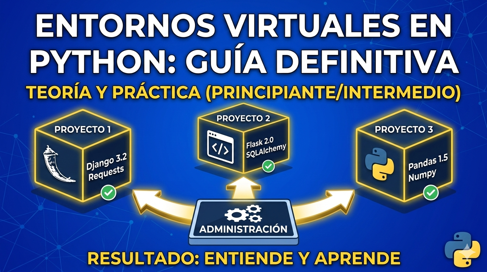

<div align="center">
    <kbd>
        <h1><b>CURSO DE PYTHON</b><br>INTRODUCCIÓN GENERAL</b></h1>
        
    </kbd>
    <br>
    <br>
    <h2><b>VIRTUAL ENVIRONMENTS [ENTORNOS VIRTUALES]</b></h2>

Un entorno virtual es un entorno `Python` aislado que nos permite tener una copia independiente de Python y sus paquetes para cada proyecto.

Esto significa que podemos tener diferentes versiones de Python y paquetes instalados en cada entorno virtual, sin interferir con otros proyectos o el sistema global de Python en nuestra máquina.

El objetivo es evitar conflictos entre librerías instaladas*, o incluso por cambios de versión de Python. Por este motivo es muy habitual también a la hora de colaborar entre varias personas, o en proyectos Open Source.

<br>

## ¿Qué es un entorno virtual?

Un Entorno virtual es simplemente una carpeta con una estructura determinada que Python crea por nosotros.

Ejemplo:

<br>

```bash
mi_proyecto/
├── venv/
│   ├── bin/
│   │   ├── python
│   │   └── pip
│   ├── lib/
│   │   └── python3.x/
│   │       └── site-packages/
│   └── pyvenv.cfg
└── src/
    └── main.py
```

> **Nota:** La estructura puede variar ligeramente dependiendo del sistema operativo (Windows, macOS, Linux).

<br>

### En resumen, esta carpeta contiene:

    - Un intérprete de Python determinado (o un enlace simbólico a él)
    - Ficheros de configuración
    - Una carpeta con las librerías que añadimos al entorno
    - Scripts (que por ejemplo activan o desactivan el entorno)

Cuando lanzamos Python, y previamente hemos activado en la misma sesión de terminal un entorno, Python sabe que “no tiene que salirse de su entorno”.

Así que, a efectos prácticos, es como si tuviéramos una “pequeña instalación independiente de Python” (es decir, un entorno virtual).

<br>

## Activación del entorno virtual

Una vez creado el entorno virtual, necesitamos activarlo para comenzar a usarlo. Para ello tenemos que llamar a un pequeño Script llamado activate que está guardado en la carpeta Scripts del entorno:


<br>

### Windows

```powershell
venv\Scripts\activate
```

### macOS

```bash
source venv/bin/activate
```

### Linux

```bash
source venv/bin/activate
```

<br>

## Desactivación del entorno virtual

Cuando hayamos terminado de trabajar en nuestro proyecto y queramos salir del entorno virtual, simplemente ejecutamos:

Windows
```powershell
deactivate
```

macOs
```bash
deactivate
```

linux
```bash
deactivate
```
<br>

## Crear un entorno virtual

Para crear un entorno virtual, ejecutamos el siguiente comando:

```bash
python -m venv <nombre_del_entorno>
```


