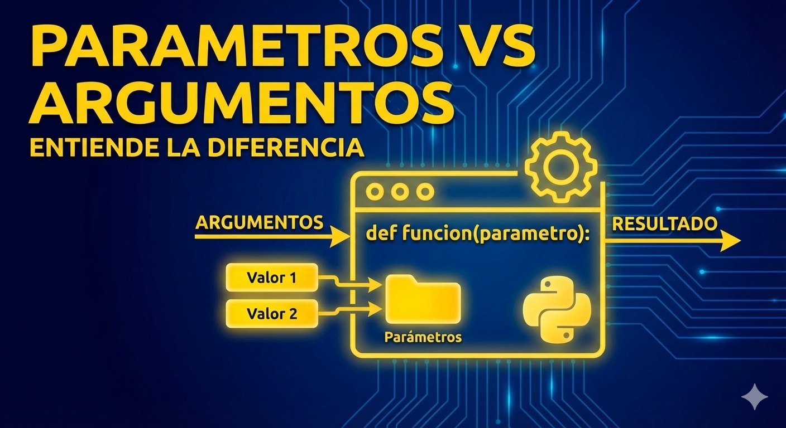

<div align="center">
    <kbd>
        <h1><b>CURSO DE PYTHON</b><br>TEMA: LAS FUNCIONES DEFINIDAS</b></h1>
        
    </kbd>
    <br>
    <br>
    <h2>TIPOS DE PARAMETROS EN FUNCIONES DEFINIDAS EN PYTHON <kbd>def</kbd></h2>
</div>

<br>

## 1. INTRODUCCIÓN

En la sección anterior exploramos los conceptos básicos sobre las funciones definidad en python, sintaxis básica correspondiente a cada elemento dentro de una función estandar, ahora vamos a profundizar sobre los tipos de parametros que podemos pasar a una función en python.

## 2. TIPOS DE PARÁMETROS EN PYTHON


En `python` para el manejo de parametros en funciones definidad, exixten 5 tipo de parameros

<div style="font-family: 'Segoe UI', Tahoma, Geneva, Verdana, sans-serif; margin: 20px; color: #e0e0e0;">
  <table style="width: 100%; border-collapse: separate; border-spacing: 0; background-color: #1e1e1e; border-radius: 12px; overflow: hidden; box-shadow: 0 8px 24px rgba(0,0,0,0.3); border: 1px solid #333;">
    <thead>
      <tr style="background: linear-gradient(90deg, #4a90e2, #63b3ed);">
        <th style="padding: 15px 20px; text-align: left; color: white; font-weight: 600; text-transform: uppercase; font-size: 14px; letter-spacing: 1px;">Tipo</th>
        <th style="padding: 15px 20px; text-align: left; color: white; font-weight: 600; text-transform: uppercase; font-size: 14px; letter-spacing: 1px;">Descripción</th>
        <th style="padding: 15px 20px; text-align: left; color: white; font-weight: 600; text-transform: uppercase; font-size: 14px; letter-spacing: 1px;">Ejemplo</th>
      </tr>
    </thead>
    <tbody>
      <tr style="border-bottom: 1px solid #333;">
        <td style="padding: 15px 20px; font-weight: bold; color: #4a90e2; border-bottom: 1px solid #333;">Posicionales</td>
        <td style="padding: 15px 20px; border-bottom: 1px solid #333;">Se asignan según el orden en que se definieron.</td>
        <td style="padding: 15px 20px; border-bottom: 1px solid #333;"><code style="background: #2d2d2d; padding: 4px 8px; border-radius: 4px; color: #f8f8f2;">saludar("Ana", "Hola")</code></td>
      </tr>
      <tr style="border-bottom: 1px solid #333;">
        <td style="padding: 15px 20px; font-weight: bold; color: #4a90e2; border-bottom: 1px solid #333;">Palabras clave</td>
        <td style="padding: 15px 20px; border-bottom: 1px solid #333;">Se especifican por el nombre del parámetro.</td>
        <td style="padding: 15px 20px; border-bottom: 1px solid #333;"><code style="background: #2d2d2d; padding: 4px 8px; border-radius: 4px; color: #f8f8f2;">saludar(mensaje="Hola", nombre="Ana")</code></td>
      </tr>
      <tr style="border-bottom: 1px solid #333;">
        <td style="padding: 15px 20px; font-weight: bold; color: #4a90e2; border-bottom: 1px solid #333;">Predeterminados</td>
        <td style="padding: 15px 20px; border-bottom: 1px solid #333;">Valores que se usan si no se envía un argumento.</td>
        <td style="padding: 15px 20px; border-bottom: 1px solid #333;"><code style="background: #2d2d2d; padding: 4px 8px; border-radius: 4px; color: #f8f8f2;">def saludar(nombre="Mundo"):</code></td>
      </tr>
      <tr style="border-bottom: 1px solid #333;">
        <td style="padding: 15px 20px; font-weight: bold; color: #4a90e2; border-bottom: 1px solid #333;">Valor vs Referencia</td>
        <td style="padding: 15px 20px; border-bottom: 1px solid #333;">Inmutables se pasan por valor; mutables (listas/dicts) por referencia.</td>
        <td style="padding: 15px 20px; border-bottom: 1px solid #333;"><code style="background: #2d2d2d; padding: 4px 8px; border-radius: 4px; color: #f8f8f2;">def mod(lista): lista.append(1)</code></td>
      </tr>
      <tr>
        <td style="padding: 15px 20px; font-weight: bold; color: #4a90e2;">Longitud Variable</td>
        <td style="padding: 15px 20px;">Permiten recibir un número arbitrario de argumentos (*args, **kwargs).</td>
        <td style="padding: 15px 20px;"><code style="background: #2d2d2d; padding: 4px 8px; border-radius: 4px; color: #f8f8f2;">def suma(*numeros): return sum(numeros)</code></td>
      </tr>
    </tbody>
  </table>
</div>

<br>

### **`2.1 PARÁMETROS POSICIONALES`**

Los parámetros posicionales son los parámetros más comunes. Se definen en el orden en que aparecen en la lista de parámetros de la función y se pasan a la función en el mismo orden.

````python

def suma(a, b):
    resultado = a + b
    return resultado

# Llamada a la función con parámetros posicionales
resultado_suma = suma(5, 3)
print(resultado_suma)  # Salida: 8

````
---
<br>

### **`2.2 PARÁMETROS POR PALABRA CLAVE/NOMBRE`**

Los parámetros con nombre son **parámetros que se pasan a la función utilizando su nombre** (en lugar de su posición).

Esto permite cambiar el orden de los parámetros o incluso omitir algunos de ellos.

````python

def saludar(nombre, saludo="Hola"):
    print(saludo + ",", nombre)

# Llamada a la función con parámetros con nombre
saludar(nombre="Ana")  # Salida: Hola, Ana
saludar(saludo="Buenos días", nombre="Pedro")  # Salida: Buenos días, Pedro

````

<br>

### **`2.3 PARÁMETROS POR VALORES PREDETERMINADOS`**

Los parámetros con valores predeterminados **son parámetros que tienen un valor asignado por defecto** en la definición de la función. 

Si no se proporciona un valor para estos parámetros al llamar a la función, se utilizará el valor predeterminado.

````python

def saludar(nombre="Mundo"):
    print("Hola,", nombre)

# Llamada a la función sin proporcionar un valor para el parámetro
saludar()  # Salida: Hola, Mundo

# Llamada a la función con un valor para el parámetro
saludar("Luis")  # Salida: Hola, Luis

````
---

<br>

### **`2.4 PARÁMETROS POR VALOR VS REFERENCIA`**

En **Python**, el paso de argumentos a funciones **se realiza siempre por `valor`** (es decir, que la función siempre recibe una copia del argumento).

Pero el comportamiento será diferente si lo que pasamos es un tipo básico o una referencia.

>Importante:
>- En un `tipo básico`, la función invocada **no podrá modificar** el argumento que recibe
>- En un `tipo referencia`, **sí podrá modificar** el argumento que recibe.

<br>

Vamos a verlo con un ejemplo. Primero veamos el comportamiento cuando **pasamos un tipo básico**. Por ejemplo, pasamos número entero (`int`) a la función `modificar_numero()`. 

Dentro de la función, multiplicamos el número por 2. Esta modificación no afecta al número original fuera de la función.

```python
# Ejemplo con un tipo básico (int)

def modificar_numero(numero):
    numero = numero * 2

numero_original = 5
modificar_numero(numero_original)
print("Número original después de llamar a la función:", numero_original)  # Resultado: 5


```

<br>

Ahora **veamos lo que pasa con un tipo referencia**, por ejemplo una lista que pasamos como referencia a la función `modificar_lista()`. 

Dentro de la función, añadimos el número 4 a la lista. La modificación realizada dentro de la función se refleja en la lista original fuera de la función.

```python
# Ejemplo con un tipo referencia (lista)

def modificar_lista(lista):
    lista.append(4)

lista_original = [1, 2, 3]
modificar_lista(lista_original)
print("Lista original después de llamar a la función:", lista_original)  # Resultado: [1, 2, 3, 4]

```
---

<br>

### **`2.5 PARÁMETROS DE LONGITUD VARIABLE`**

<div align="center">
    <kbd>
        
    </kbd>
</div>

<br>

#### **Manejo de Argumentos De Longitud Variables (`*args` y `**kwargs`) en Python**

#### 1. Introducción y Conceptos Fundamentales

En el desarrollo profesional con Python, nos enfrentamos a menudo a la rigidez de las **funciones con parámetros fijos**. Si una función define tres parámetros, el intérprete exigirá exactamente tres argumentos. Sin embargo, hay ocaciones en las que necesitamos construir herramientas verdaderamente más flexibles y reutilizables, para lo cual es necesitamos mecanismos que permitan un número indefinido de valores. Aquí es donde entran `*args` y `**kwargs`.

#### **Propósito y Mecánica**

Estos elementos actúan como **comodines** `wildcards`. Permiten que una función se adapte dinámicamente a la carga de datos que el usuario decida enviar en tiempo de ejecución, ya sean dos, cinco o ningún valor.

<br>

#### **Convención vs. Sintaxis***

**Es vital distinguir entre lo que Python exige y lo que la comunidad recomienda:**

- La Sintaxis Real:  Son los símbolos asterisco (*) y doble asterisco (**). Estos son los que el intérprete de Python reconoce para activar el empaquetado de argumentos.

- La Convención:  Los nombres args (de  arguments ) y kwargs (de  keyword arguments ) son estándares de la industria. Aunque técnicamente podrías usar *objetos o *argumentos, seguir la convención mejora la legibilidad para otros desarrolladores.Resumen de características:

    - Flexibilidad Total:  Permiten crear funciones que aceptan N argumentos.

    - Seguridad:  Evitan errores de tipo TypeError por exceso o falta de argumentos posicionales.

    - Naturaleza Interna:  Transforman los datos entrantes en estructuras de datos nativas (tuplas y diccionarios).

---
<br>

### 2. Análisis Profundo de *args (Argumentos Posicionales)

El parámetro `*args` permite capturar argumentos posicionales adicionales y los almacena internamente en una  tupla .

#### El **Comportamiento del `Comodín`**

<br>

Cuando enviamos valores a una función con *args, Python crea una "ilusión" de múltiples argumentos, cuando en realidad los está empaquetando en una sola estructura inmutable. Si no se pasa ningún argumento, Python genera una tupla vacía, lo que garantiza que el flujo de la función no se rompa.

<br>

#### **Caso de Estudio: La Función print()**

<br>

En la versión **3.11 de Python**, la función `print()` está definida utilizando un parámetro variable (frecuentemente llamado `*objects`). Esta es la razón técnica por la cual:

- Podemos pasarle múltiples strings o variables separados por comas.

- Podemos llamarla sin argumentos (`print()`), lo que resulta en la impresión de un simple salto de línea. Gracias a `*args`, la ausencia de valores no se considera un error, sino una `tupla` de **longitud cero**.

<br>

#### **Demostración Técnica**

```python


def procesar_elementos(*args):
    # Demostramos que internamente es una tupla
    print(f"Estructura interna: {type(args)} - Contenido: {args}")
    
    # Al ser iterable, podemos procesar cada elemento fácilmente
    for i, arg in enumerate(args):
        print(f"Argumento {i}: {arg}")


# Podemos pasar cualquier cantidad de datos
procesar_elementos("Senior", 2024, True) 


```
---
<br>

### **3.Análisis Profundo de `**kwargs` (Argumentos de Clave)**

Mientras que *args maneja posiciones, **kwargs captura argumentos con nombre (`clave-valor`) y los organiza en un  diccionario .

<br>

#### **Métodos Esenciales de Manipulación**

<div style="font-family: 'Segoe UI', Tahoma, Geneva, Verdana, sans-serif; margin: 20px; color: #e0e0e0;">
  <table style="width: 100%; border-collapse: separate; border-spacing: 0; background-color: #1a1a1a; border-radius: 12px; overflow: hidden; box-shadow: 0 8px 24px rgba(0,0,0,0.4); border: 1px solid #333;">
    <thead>
      <tr style="background: linear-gradient(90deg, #805ad5, #b794f4);">
        <th style="padding: 15px 20px; text-align: left; color: white; font-weight: 600; text-transform: uppercase; font-size: 13px; letter-spacing: 1.2px; width: 30%;">Método</th>
        <th style="padding: 15px 20px; text-align: left; color: white; font-weight: 600; text-transform: uppercase; font-size: 13px; letter-spacing: 1.2px;">Descripción del Retorno</th>
      </tr>
    </thead>
    <tbody>
      <tr style="border-bottom: 1px solid #333;">
        <td style="padding: 15px 20px; border-bottom: 1px solid #333;">
          <code style="background: #2d2d2d; padding: 4px 10px; border-radius: 6px; color: #d6bcfa; font-size: 0.95em; border: 1px solid #44337a;">.keys()</code>
        </td>
        <td style="padding: 15px 20px; border-bottom: 1px solid #333; line-height: 1.6;">
          Devuelve un objeto de vista con los <strong>nombres de los argumentos</strong> (claves).
        </td>
      </tr>
      <tr style="border-bottom: 1px solid #333;">
        <td style="padding: 15px 20px; border-bottom: 1px solid #333;">
          <code style="background: #2d2d2d; padding: 4px 10px; border-radius: 6px; color: #d6bcfa; font-size: 0.95em; border: 1px solid #44337a;">.values()</code>
        </td>
        <td style="padding: 15px 20px; border-bottom: 1px solid #333; line-height: 1.6;">
          Devuelve un objeto de vista con los <strong>datos pasados</strong> (valores).
        </td>
      </tr>
      <tr>
        <td style="padding: 15px 20px;">
          <code style="background: #2d2d2d; padding: 4px 10px; border-radius: 6px; color: #d6bcfa; font-size: 0.95em; border: 1px solid #44337a;">.items()</code>
        </td>
        <td style="padding: 15px 20px; line-height: 1.6;">
          Devuelve <strong>pares clave-valor</strong> empaquetados en tuplas de dos posiciones.
        </td>
      </tr>
    </tbody>
  </table>
</div>

<br>

#### **El Constructor `dict()` vs. `Literales {}`**

Como educador, recomiendo el uso del **constructor** `dict()` para mayor comodidad en ciertos contextos. A diferencia de los diccionarios creados con **llaves**, donde las **claves** deben ser **strings entre comillas** `"nombre":` `"Javier"`, el **constructor** `dict()` permite pasar argumentos de clave directamente (`nombre`=`"Javier"`), lo que hace el código más limpio y similar a una llamada de función estándar.

#### **Paso de Diccionarios Existentes**

Para inyectar un **diccionario** ya definido en una función que espera `**kwargs`, debemos usar el prefijo `**`:

```python

config = {"host": "localhost", "puerto": 3306}
mi_funcion(**config)  # Desempaqueta el diccionario en argumentos de clave

```
---
<br>

###  **4. Reglas de Oro: El Orden de los Parámetros**

Como desarrollador, se debe enfatizar que **el orden de los parámetros no es opcional**; es una restricción sintáctica de Python.

<br>

#### **La Jerarquía Obligatoria**

- **`Parámetros fijos (posicionales)`**:  **Obligatorios y prioritarios**.

- **`*args`**:  Captura el resto de los posicionales.

- **`**kwargs`**:  Captura todos los argumentos con nombre.

#### **DEMOSTRACIÓN TÉCNICA**

```python
#EJEMPLO TÉCNICO DE LAS REGLAS DE JERARQUÍA Y EL ORDEN DE LOS PARAMETROS

def calcular_area(x,y, *args):
    pass
calcular(a,b,c,d,e,f)

```

<br>

#### **El Efecto de "Sombreado" (Shadowing)**

Si intentas colocar un parámetro fijo después de *args, Python arrojará un error. Esto ocurre porque *args tiene una naturaleza "voraz": consume todos los argumentos posicionales restantes en el stack de llamadas. El parámetro fijo que queda después queda "a la sombra" de *args y nunca podrá recibir un valor, ya que Python interpreta que todo lo que sigue pertenece a la tupla de argumentos variables.

**--- EJEMPLO ERRÓNEO ---**

```python
def calcular(base, *args, impuesto): 
     pass
 calcular(10, 5, 2, 0.15) 
 ERROR: 'impuesto' nunca recibe valor porque 5, 2 y 0.15 entran en *args.

```

<br>

**--- EJEMPLO CORRECTO ---**

```python


def calcular_correcto(base, impuesto, *args):
    resultado_base = base * (1 + impuesto)
    print(f"Resultado base: {resultado_base}")
    print(f"Valores adicionales procesados: {args}")


calcular_correcto(100, 0.21, "Nota1", "Nota2")

```
---
<br>

### **5. Aplicaciones Prácticas y Contexto Profesional**

#### Multiplicación Flexible (Procesamiento en Línea)

***args nos permite realizar operaciones en masa con una sola instrucción:**

```python


def aplicar_factor_quince(*args):
    # Realiza múltiples cálculos sin necesidad de múltiples llamadas
    for numero in args:
        print(f"Operación: {numero} x 15 = {numero * 15}")


aplicar_factor_quince(10, 20, 30)


```

<br>

#### **Decoplamiento de Configuraciones (Ejemplo: MySQL)**

En aplicaciones profesionales, usamos **kwargs para desacoplar la configuración de la lógica. Podemos tener un diccionario con host, user y password y pasarlo a una función de conexión. Esto permite que, si en el futuro la API de conexión requiere un parámetro nuevo (como port o ssl), no necesitemos modificar la firma de todas nuestras funciones, solo el diccionario de configuración.


#### Uso Combinado

```python


def log_sistema(nivel, *mensajes, **detalles):
    print(f"[{nivel}]")
    for msg in mensajes:
        print(f"- {msg}")
    if detalles:
        print(f"Metadata: {detalles}")


log_sistema("ERROR", "Fallo de conexión", "Timeout", usuario="admin", ip="192.168.1.1")


```

---

<br>

#### **DESEMPAQUETADO**

> Uso de \* y \*\* al llamar una función

#### **OPERADOR PARA DESEMPAQUETADO DE LISTAS**

El operador `*` se utiliza cuando queremos `desempaquetar los elementos` de una **lista** y pasarlos como `argumentos` a una `función`.

```python


def sumar(a, b, c):
    return a + b + c

valores = [1, 2, 3]
print(sumar(*valores))  # Resultado: 6


```

    Aquí,

    valores es una lista que contiene [1, 2, 3]
    Al llamar sumar(*valores), los elementos de la lista se desempaquetan y se pasan como argumentos a la función sumar
    Es decir, es equivalente a llamar sumar(1, 2, 3)

<br>

#### **OPERADOR PARA DESEMPAQUETADO DE DICCIONARIOS**

El operador `**` se utiliza de manera similar, pero para desempaquetar los elementos de un diccionario y pasarlos como argumentos a una función.

En este caso, las claves del diccionario se convierten en nombres de parámetros y los valores del diccionario se asignan a esos parámetros.

```python


diccionario = {"a": 1, "b": 2, "c": 3}
print(sumar(**diccionario))  # Resultado: 6

```

    Aquí,

    diccionario es un diccionario que contiene {"a": 1, "b": 2, "c": 3}
    Al llamar sumar(**diccionario), los elementos del diccionario se desempaquetan y se pasan como argumentos a la función sumar,
    La clave "a" se asigna al parámetro a, la clave "b" se asigna a b y la clave "c" se asigna a c
    Es decir, es equivalente a llamar sumar(a=1, b=2, c=3)

<br>

### 6. Resolución Detallada de Ejercicios**

#### **Ejercicio 1:** Reparación de Función de Suma

**Problema:**  Una función de suma limitada a parámetros fijos.  

```python

def suma_flexible():
    return sum(args)

print(suma_flexible(*args[0], *args[1], *args[2], *args[2]))


```

**Solución:**  Implementar `*args` para permitir la suma de N elementos.

```python
def suma_flexible(*args):
    return sum(args) 


print(suma_flexible(*args[0], *args[1], *args[2], *args[2])) # Retorna 100

```

<br>

#### **Ejercicio 2:** Identificación de Errores de Posición

**Problema:**  Código con parámetros fijos tras `*args`.  

```python

def funcion_corregida(x, *args, y):
    print(f"X: {x}, Y: {y}")
    print(f"Adicionales en args: {args}")


# Llamada: 10 -> x, 20 -> y, (30, 40, 50) -> args
funcion_corregida(10, 20, 30, 40, 50)

```

**Ésta sería la salida de la ejecución de esta función cuyo orden de parametros viola las relas de ordenamiento y jerarquía de estos**

```bash

Traceback (most recent call last):
  File "tu_archivo.py", line 8, in <module>
    funcion_corregida(10, 20, 30, 40, 50)
TypeError: funcion_corregida() missing 1 required keyword-only argument: 'y'

```

<br>

**Análisis:**  El error reside en que `y` e y no pueden recibir valores si están después de un `argumento de longitud variable`.  

<br>

**Solución Corregida**: Siempre se deben colocar primeros los parametros posicionales fijos, lurgo los parametros de lomgitud variable (`*args` / `**kwargs`)

```python

def funcion_corregida(x, y, *args):
    print(f"X: {x}, Y: {y}")
    print(f"Adicionales en args: {args}")


# Llamada: 10 -> x, 20 -> y, (30, 40, 50) -> args
funcion_corregida(10, 20, 30, 40, 50)

```

**Ésta sería la salida de la ejecución de este codigo que si es correcti y respeta las relas de ordenamiento y jerarquía de estos**

```bash

X: 10, Y: 20
Adicionales en args: (30, 40, 50)

```
<br>

#### **Ejercicio 3:** Desafío muestra_datos

**Reto:**  Mostrar todas las claves y valores de un diccionario en una frase dinámica.<br>
El nombre es Javier, sus apellidos son Gómez y su edad es 27. (Campos: nombre, apellidos, edad)

**Lógica Técnica:**  Los métodos  `.keys()` y `.values()` devuelven tipos de datos especiales conocidos como  view objects  (`dict_keys` y `dict_values`). Aunque son iterables,  no son indexables  (no puedes hacer `keys()0`). Para acceder a índices específicos como pedía el reto, debemos transformarlos explícitamente a `tuplas` o `listas .

```python


def muestra_datos(**kwargs):
    # Transformación necesaria: de view objects a tuplas indexables
    claves = tuple(kwargs.keys())
    valores = tuple(kwargs.values())
    
    # Construcción de la frase usando índices
    frase = (f"El nombre es {valores[0]}, sus apellidos son {valores[1]} "
             f"y su edad es {valores[2]}. (Campos: {claves[0]}, {claves[1]}, {claves[2]})")
    print(frase)


usuario = {"nombre": "Javier", "apellidos": "Gómez", "edad": 27}
muestra_datos(**usuario)

```