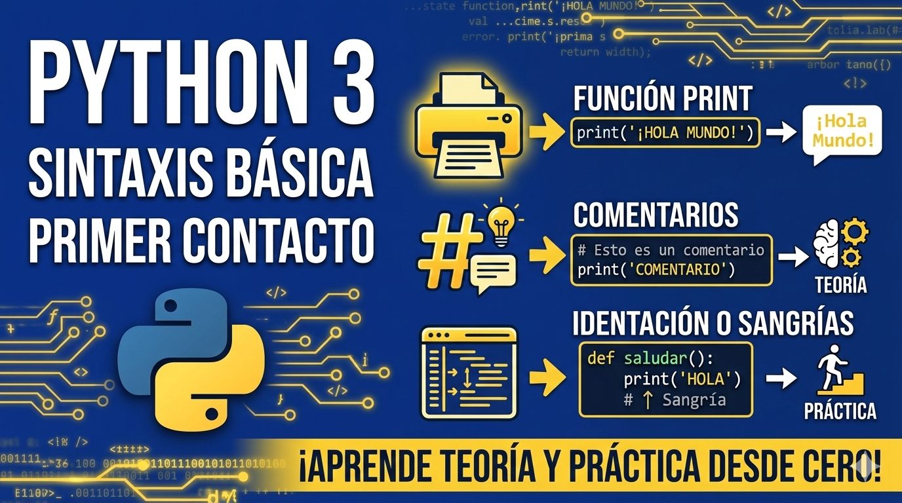

<div align="center">
    <kbd>
        <h1><b>CURSO DE PYTHON</b><br>SINTAXIS BÁSICA</b></h1>
        
    </kbd>
    <br>
    <br>
    <h2><b>VIRTUAL PRIMER CONTACTO CON EL LENGUAJE</b></h2>
</div>

<br>

## **DESCRIPCIÓN & EJEMPLOS:**

<br>

**¿Qué es print en Python?**

**`print()`** es una función incorporada **`built-in function`** de Python que se utiliza para mostrar información en la salida estándar, normalmente la consola o terminal.

✔️ Es parte del núcleo del lenguaje

✔️ No requiere importar módulos

✔️ Existe desde las primeras versiones de Python

Fuente oficial: Documentación de Python – [Built-in Functions](https://docs.python.org/3/library/functions.html)

<br>

**SINTAXIS BÁSICA :**

```python
print(objeto)
```

**EJEMPLO :**

```python
print("Hola mundo")
```

**SALIDA :**


```text
Hola mundo

```

También con la función de **print()** podemos imprimir varios valores separandolos por coma seguido de un espacio.

**EJEMPLO:**

```python
print("Hola mundo", 21, 3.14, "jhon doe")
```

**SALIDA**

```text
Hola mundo, 21, 3.14, jhon doe
```
---
<br>

---

# **LOS COMENTARIOS EN PYTHON**

<br>
## **¿Qué son los comentarios en Python?**

**Los comentarios** son texto que el intérprete de Python ignora completamente al ejecutar el programa.
Su finalidad es explicar el código a las personas, no a la máquina.

<br>

**Definición oficial (Python docs):**

Los comentarios se utilizan para explicar el código y hacerlo más legible.
Fuente: Documentación oficial de Python

https://docs.python.org/3/reference/lexical_analysis.html#comments

<br>

### **Tipos de comentarios en Python**

**Comentarios de una sola línea (#)**

Es el único comentario real reconocido por el lenguaje.

Sintaxis

```python
# Esto es un comentario de una sola línea
```

Ejemplo válido

```python
x = 10  # Valor inicial
```

**Regla oficial:**

Todo lo que esté después de # hasta el final de la línea es ignorado.


Fuente:
https://docs.python.org/3/reference/lexical_analysis.html#comments

<br>

**Comentarios en línea (inline comments)**

Se escriben en la misma línea que el código.

Ejemplo
```python
total = price * quantity  # Cálculo del total
```
**Buenas prácticas (PEP 8):**

Usarlos con moderación

Separarlos del código por al menos dos espacios

Solo si aportan valor real

**Fuente:**

PEP 8 – Inline Comments
https://peps.python.org/pep-0008/#inline-comments

<br>

## **Comentarios de bloque (múltiples líneas)**

Python NO tiene una sintaxis especial para comentarios multilínea.
Se construyen usando varias líneas con #.

Ejemplo correcto
```python
# Este bloque explica
# por qué se usa este algoritmo
# y no otro.
```

Esto sí es un comentario real.

<br>

**Aclaración importante: triple comillas (""" """) NO son comentarios**

Esto es una confusión muy común.

**Ejemplo:**

```python
"""
Esto no es un comentario.
Es una cadena de texto.
"""
```
Hecho verificable:

Python interpreta esto como un string

Si no está asignado, se crea y luego se descarta

No es un comentario

<br>

**Fuente oficial:**

https://docs.python.org/3/reference/lexical_analysis.html#strings

<br>

**Docstrings (NO son comentarios)**

Los docstrings son cadenas de documentación, no comentarios.

Ejemplo:
```python
def suma(a, b):
    """Devuelve la suma de dos números."""
    return a + b
```
<br>

**Diferencias clave**

<table width="100%" align="center">
  <tr>
    <td align="center" width="50%">
      <kbd>
        <strong>Comentarios</strong><br><br>
        Ignorados por Python<br>
        No accesibles en runtime<br>
        Explican decisiones
      </kbd>
    </td>
    <td align="center" width="50%">
      <kbd>
        <strong>Docstrings</strong><br><br>
        Almacenados en <code>__doc__</code><br>
        Accesibles con <code>help()</code><br>
        Documentan interfaces
      </kbd>
    </td>
  </tr>
</table>

<br>

📌 Fuente:
PEP 257 – Docstring Conventions
https://peps.python.org/pep-0257/

<br>

## 🟦 Buenas prácticas oficiales (PEP 8)

✔ Qué SÍ hacer
1️⃣ Explicar el por qué, no el qué

<br>

```python
# Evitamos división por cero si la lista está vacía
if count == 0:
    return None
```

📌 Fuente: PEP 8
https://peps.python.org/pep-0008/#comments

<br>

**Usar lenguaje claro y conciso**

Frases completas

Primera letra en mayúscula

Punto final en comentarios largos

**Mantener comentarios actualizados**

Un comentario incorrecto es peor que no tener comentario.

📌 Fuente: PEP 8

❌ Qué NO hacer
❌ Comentarios obvios

```python
i = i + 1  # Incrementa i en 1
```

PEP 8 considera esto ruido innecesario.

❌ Usar comentarios para ocultar código

```python
# print("Debug")
```

Mejor usar control de versiones (Git).

❌ Abusar de comentarios en lugar de buen código

Esto es una regla de ingeniería, no sintáctica:

Si necesitas demasiados comentarios, probablemente el código no es claro.

📌 Fuente:
PEP 8 – Comments

**Relación entre comentarios y mantenibilidad**

Según la documentación oficial:

Los comentarios no afectan el rendimiento

Afectan directamente:

Mantenibilidad

Trabajo en equipo

Escalabilidad del proyecto

Fuente:

https://docs.python.org/3/tutorial/controlflow.html#comments

---

<br>

## **IDENTACIÓN O SANGRÍAS**

**¿Qué es la sangría en Python?**

**La sangría** es el espacio (generalmente espacios en blanco) que se deja al inicio de una línea para indicar que esa línea pertenece a un bloque.

**En Python:**

* No se usan llaves {} como en otros lenguajes.

* El bloque se define únicamente por la sangría.

**Fuente oficial:**

Documentación de Python – [Indentation](https://docs.python.org/es/3/tutorial/introduction.html)

**EJEMPLO :**
```python
#los espscios al principos son sangrias:

if 5 == 2:
    print("aaaa")    
    print("sjjdjdd")
else :
    print("else")
```